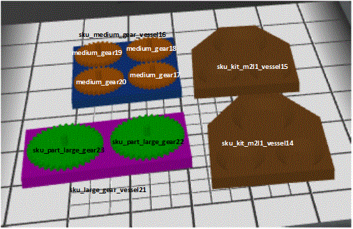
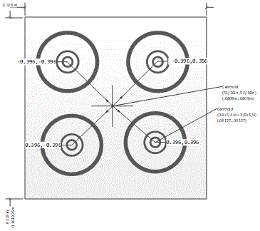
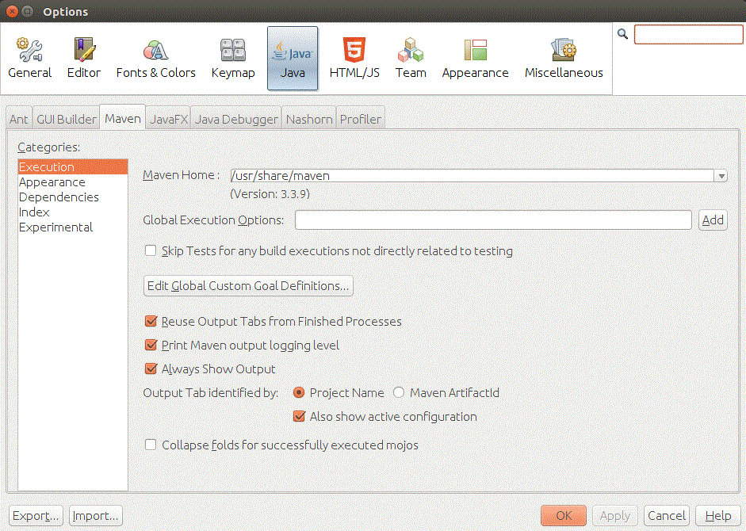

# Java Simulated Kitting Demo
----



Java Simulated Kitting Demo is a mostly self-contained CRCL testing harness that uses a basic kitting scene for simulation, including robot motion, gears, supply trays, and kits. 

## Install

Platform prerequisites:

- Ubuntu 16.04

- Netbeans 8.2 with 

- Oracle JDK version 1.8.  (You will need to configure maven to use oracle maven in Netbeans.) 

- The crclbase, crclutils, and rcs projects produce jar files that are used by GwendolynCrclClient and have been prebuilt and installed a libraries in the GwendolynCrclClient project. Note, the crclbase contains Java for CRCL but instead the crclbase-model which contains CRCL support for all model status reporting and inferences, is used. There is no CRCL XML decoding in the embedded kitting simulation, so this is not critical but would be for an end-to-end simulation involving CRCL command/status control.

First, clone the Gwendolyn github repository : found at [<u>here</u>](https://github.com/usnistgov/gwendolyn) You only need the Netbeans Projects  but an end-to-end kitting simulation is included in the code (described elsewhere). Start Netbeans and select the folder GwendolynCrclClient to open the NB project and right click on the project name to Clean and Build, and you are ready to run.

The Java embedded kitting simulation relies on CRCL and posemath utilities produced by NIST and contained in jar files. There is Javadoc documentation describing the CRCL and posemath which can be found [<u>here</u>](https://usnistgov.github.io/gzaprsros/crcl/): 

The GwendolynCrclClient also has Javadoc but it is not online. You can generate it in Netbeans by right clicking on the GwendolynCrclClient project name and selecting the command: Generate Javadoc.

## Usage

The Java code should already be compiled into a jar file that can run if you have installed Java. There is also a bash script (i.e., crcl4java-utils.bash) to run the embedded CRCL testing harness, that can be found under the NetbeansProject folder.

	.../NetBeansProjects/gwendolencrclclient.bash 

The bash script changes directory (i.e., cd)  to the Java jar folder and runs the following

	> java -jar GwendolynCrclClient.jar --loopback 

Thus gwendolyncrclclient.bash bash script sets up the embedded CRCL test harness, as part of the command line arguments, described below.

### Command Line Arguments

	> java -jar GwendolynCrclClient.jar -h 
	usage: java -jar GwendolynCrclClient.jar [-d] [-h] [-l] 
	  -d,--debug      debug statements 
	  -h,--help       print usage 
	  -l,--loopback   loopback crcl behavior 

If you do not use --loopback as an argument, a CRCL socket connection to port 64444, will be established and must exist – the code is a basic example and not smart enough to keep attempting to connect to the socket.

## Configuration

The GwendolynCrclClient is NOT configured to be self-contained as is.  The variable

	class  Globals 
	… 
	public static boolean bLoopback = false 

is the flag that tell the application that it is an embedded CRCL simulation, with no outside socket interface to a CRCL server. YOU NEED TO USE THE COMMAND LINE FLAG –loopback or -l to run embedded loopback simulation. The, model setup and inferences are all embedded within the Java code and run instead of a CRCL connected socket to a CRCL server (robot/simulation/etc.). 



In Netbeans, choose menu: Debug-> Debug Project (GwendolynCrclClient) and you should see output if you select the Output tab closely matching the output given in the next section.



## Input

The initial kitting scene is hard coded in the embedded CRCL loopback simulation. The following is hard coded as the kits, supply vessels, and gears in the kitting demo. Each model has a name (which is a combination of a sku type and an trailing numeric identifier) as well as a position. 

	sku_kit_m2l1_vessel14 at 0.40, -1.05, 0.92,0.000,0.000,-0.720,0.694 
	sku_kit_m2l1_vessel15 at 0.18, -1.05, 0.92,0.000,0.000,-0.720,0.694 
	sku_medium_gear_vessel16 at 0.19, -1.24, 0.92,0.000,0.000,0.017,1.000 
	sku_part_medium_gear17 at 0.23, -1.20, 0.92,-0.011,-0.003,0.022,1.000 
	sku_part_medium_gear18 at 0.15, -1.20, 0.92,-0.001,-0.001,0.017,1.000 
	sku_part_medium_gear19 at 0.15, -1.28, 0.92,0.001,-0.003,0.018,1.000 
	sku_part_medium_gear20 at 0.23, -1.28, 0.92,-0.002,0.001,0.012,1.000 
	sku_large_gear_vessel21 at 0.39, -1.26, 0.92,0.000,0.000,0.721,0.693 
	sku_part_large_gear22 at 0.39, -1.21, 0.92,0.002,-0.002,0.016,1.000 
	sku_part_large_gear23 at 0.39, -1.32, 0.92,-0.002,-0.001,0.188,0.982 

This kitting setup corresponds to the following diagram



Included in the hard coding setup is the definition of all the types of objects in the kitting scene; gears, trays, and slots. For example, the following shows the physical relationships for the medium gear supply tray:



## Medium Vessel

<TABLE>

<TR>

<TD>Name </TD>

<TD>Type </TD>

<TD>State </TD>

<TD>Distance from Centroid </TD>
</TR>

<TR>

<TD>Slot1 </TD>

<TD>Medium Gear Slot </TD>

<TD>Filled/ Open </TD>

<TD>0.0396, 0.0396, 0.0 </TD>
</TR>

<TR>

<TD>Slot2 </TD>

<TD>Medium Gear Slot </TD>

<TD>Filled/ Open </TD>

<TD>-0.0396, 0.0396, 0.0 </TD>
</TR>

<TR>

<TD>Slot3 </TD>

<TD>Medium Gear Slot </TD>

<TD>Filled/ Open </TD>

<TD>0.0396, -0.0396,0.0 </TD>
</TR>

<TR>

<TD>Slot4 </TD>

<TD>Medium Gear Slot </TD>

<TD>Filled/ Open </TD>

<TD>-0.0396, -0.0396,0.0 </TD>
</TR>

</TABLE>





Given this knowledge, inferences about the the state of tray slots  and gear states are inferred from the scene.



## Output

Log of Simulated Kitting Demo in Java with hard coded kitting scene from agility lab, mathematical reasoned gear pick and place repositioning, and inferencing of kitting free gears and open slots embedded in Java code.



The Java console output:



	debug: 
	 
	issueCrclCommand class crcl.base.MoveToType 0.3990, -0.0600, 0.0408 1.0000,  0.0000,  0.0000,  0.0000,  
	issueCrclCommand class crcl.base.DwellType:0.1  
	issueCrclCommand class crcl.base.MoveToType 0.3990, -0.0600, 0.0008 1.0000,  0.0000,  0.0000,  0.0000,  
	issueCrclCommand class crcl.base.DwellType:0.1  
	issueCrclCommand class crcl.base.SetEndEffectorType close 
	Closest Gear to commanded locationsku_part_medium_gear17 
	 
	 
	issueCrclCommand class crcl.base.DwellType:2.0  
	issueCrclCommand class crcl.base.MoveToType 0.3990, -0.0600, 0.0408 1.0000,  0.0000,  0.0000,  0.0000,  
	issueCrclCommand class crcl.base.DwellType:0.1  
	issueCrclCommand class crcl.base.MoveToType 0.6254,  0.1280, 0.0608 1.0000,  0.0000,  0.0000,  0.0000,  
	issueCrclCommand class crcl.base.DwellType:0.1  
	issueCrclCommand class crcl.base.MoveToType 0.6254,  0.1280, 0.0208 1.0000,  0.0000,  0.0000,  0.0000,  
	issueCrclCommand class crcl.base.DwellType:0.1  
	issueCrclCommand class crcl.base.SetEndEffectorType open gear new location 0.4564, -1.0120,  0.9200  0.0000,  0.0000, 0.0000, 1.0000, New kitting scene inferences after gear move 
	sku_kit_m2l1_vessel14 at  0.4000, -1.0500,  0.9200  0.0000, 0.0000, -0.7200,  0.6940, 
	     slot1 sku_part_medium_gear sku_part_medium_gear17 ( 0.4564,-1.0120, 
	0.9200) 
	     slot2 sku_part_medium_gear open ( 0.4535,-1.0920, 0.9200) 
	     slot3 sku_part_large_gear open ( 0.3600,-1.0485, 0.9200) 
	sku_kit_m2l1_vessel15 at  0.1800, -1.0500,  0.9200  0.0000, 0.0000, -0.7200,  0.6940, 
	     slot1 sku_part_medium_gear open ( 0.2364,-1.0120, 0.9200) 
	     slot2 sku_part_medium_gear open ( 0.2335,-1.0920, 0.9200) 
	     slot3 sku_part_large_gear open ( 0.1400,-1.0485, 0.9200) 
	sku_medium_gear_vessel16 at  0.1900, -1.2400,  0.9200  0.0000, 0.0000, 0.0170,  0.9999, 
	     slot1 sku_part_medium_gear open ( 0.2282,-1.1991, 0.9200) 
	     slot2 sku_part_medium_gear sku_part_medium_gear18 ( 0.1491,-1.2018, 
	0.9200) 
	     slot3 sku_part_medium_gear sku_part_medium_gear20 ( 0.2309,-1.2782, 
	0.9200) 
	     slot4 sku_part_medium_gear sku_part_medium_gear19 ( 0.1518,-1.2809, 
	0.9200) 
	sku_part_medium_gear17 at  0.4564, -1.0120,  0.9200  0.0000, 0.0000, 0.0000,  1.0000, 
	     In: sku_medium_gear_vessel16(slot1) 
	sku_part_medium_gear18 at  0.1500, -1.2000,  0.9200 -0.0010, -0.0000, 0.0170,  0.9999, 
	     In: sku_medium_gear_vessel16(slot2) 
	sku_part_medium_gear19 at  0.1500, -1.2800,  0.9200  0.0010, -0.0030, 0.0180,  0.9998, 
	     In: sku_medium_gear_vessel16(slot4) 
	sku_part_medium_gear20 at  0.2300, -1.2800,  0.9200 -0.0020, 0.0010, 0.0120,  0.9999, 
	     In: sku_medium_gear_vessel16(slot3) 
	sku_large_gear_vessel21 at  0.3900, -1.2600,  0.9200  0.0000, 0.0000, 0.7210,  0.6930, 
	     slot1 sku_part_large_gear sku_part_large_gear23 ( 0.3922,-1.3150, 
	0.9200) 
	     slot2 sku_part_large_gear sku_part_large_gear22 ( 0.3878,-1.2050, 
	0.9200) 
	sku_part_large_gear22 at  0.3900, -1.2100,  0.9200  0.0020, -0.0020, 0.0160,  0.9999, 
	     In: sku_large_gear_vessel21(slot2) 
	sku_part_large_gear23 at  0.3900, -1.3200,  0.9200 -0.0020, -0.0010, 0.1880,  0.9822, 
	     In: sku_large_gear_vessel21(slot1) 
	 
	 
	 
	issueCrclCommand class crcl.base.DwellType:2.0  
	issueCrclCommand class crcl.base.MoveToType 0.6254,  0.1280, 0.0608 1.0000,  0.0000,  0.0000,  0.0000,  
	issueCrclCommand class crcl.base.DwellType:0.1  
	issueCrclCommand class crcl.base.MoveToType 0.3190, -0.0600, 0.0408 1.0000,  0.0000,  0.0000,  0.0000,  
	issueCrclCommand class crcl.base.DwellType:0.1  
	issueCrclCommand class crcl.base.MoveToType 0.3190, -0.0600, 0.0008 1.0000,  0.0000,  0.0000,  0.0000,  
	issueCrclCommand class crcl.base.DwellType:0.1  
	issueCrclCommand class crcl.base.SetEndEffectorType close 
	Closest Gear to commanded locationsku_part_medium_gear18 
	 
	 
	issueCrclCommand class crcl.base.DwellType:2.0  
	issueCrclCommand class crcl.base.MoveToType 0.3190, -0.0600, 0.0408 1.0000,  0.0000,  0.0000,  0.0000,  
	issueCrclCommand class crcl.base.DwellType:0.1  
	issueCrclCommand class crcl.base.MoveToType 0.6225,  0.0480, 0.0608 1.0000,  0.0000,  0.0000,  0.0000,  
	issueCrclCommand class crcl.base.DwellType:0.1  
	issueCrclCommand class crcl.base.MoveToType 0.6225,  0.0480, 0.0208 1.0000,  0.0000,  0.0000,  0.0000,  
	issueCrclCommand class crcl.base.DwellType:0.1  
	issueCrclCommand class crcl.base.SetEndEffectorType open gear new location 0.4535, -1.0920,  0.9200  0.0000,  0.0000, 0.0000, 1.0000, New kitting scene inferences after gear move 
	sku_kit_m2l1_vessel14 at  0.4000, -1.0500,  0.9200  0.0000, 0.0000, -0.7200,  0.6940, 
	     slot1 sku_part_medium_gear sku_part_medium_gear17 ( 0.4564,-1.0120, 
	0.9200) 
	     slot2 sku_part_medium_gear sku_part_medium_gear18 ( 0.4535,-1.0920, 
	0.9200) 
	     slot3 sku_part_large_gear open ( 0.3600,-1.0485, 0.9200) 
	sku_kit_m2l1_vessel15 at  0.1800, -1.0500,  0.9200  0.0000, 0.0000, -0.7200,  0.6940, 
	     slot1 sku_part_medium_gear open ( 0.2364,-1.0120, 0.9200) 
	     slot2 sku_part_medium_gear open ( 0.2335,-1.0920, 0.9200) 
	     slot3 sku_part_large_gear open ( 0.1400,-1.0485, 0.9200) 
	sku_medium_gear_vessel16 at  0.1900, -1.2400,  0.9200  0.0000, 0.0000, 0.0170,  0.9999, 
	     slot1 sku_part_medium_gear open ( 0.2282,-1.1991, 0.9200) 
	     slot2 sku_part_medium_gear open ( 0.1491,-1.2018, 0.9200) 
	     slot3 sku_part_medium_gear sku_part_medium_gear20 ( 0.2309,-1.2782, 
	0.9200) 
	     slot4 sku_part_medium_gear sku_part_medium_gear19 ( 0.1518,-1.2809, 
	0.9200) 
	sku_part_medium_gear17 at  0.4564, -1.0120,  0.9200  0.0000, 0.0000, 0.0000,  1.0000, 
	     In: sku_medium_gear_vessel16(slot1) 
	sku_part_medium_gear18 at  0.4535, -1.0920,  0.9200  0.0000, 0.0000, 0.0000,  1.0000, 
	     In: sku_medium_gear_vessel16(slot2) 
	sku_part_medium_gear19 at  0.1500, -1.2800,  0.9200  0.0010, -0.0030, 0.0180,  0.9998, 
	     In: sku_medium_gear_vessel16(slot4) 
	sku_part_medium_gear20 at  0.2300, -1.2800,  0.9200 -0.0020, 0.0010, 0.0120,  0.9999, 
	     In: sku_medium_gear_vessel16(slot3) 
	sku_large_gear_vessel21 at  0.3900, -1.2600,  0.9200  0.0000, 0.0000, 0.7210,  0.6930, 
	     slot1 sku_part_large_gear sku_part_large_gear23 ( 0.3922,-1.3150, 
	0.9200) 
	     slot2 sku_part_large_gear sku_part_large_gear22 ( 0.3878,-1.2050, 
	0.9200) 
	sku_part_large_gear22 at  0.3900, -1.2100,  0.9200  0.0020, -0.0020, 0.0160,  0.9999, 
	     In: sku_large_gear_vessel21(slot2) 
	sku_part_large_gear23 at  0.3900, -1.3200,  0.9200 -0.0020, -0.0010, 0.1880,  0.9822, 
	     In: sku_large_gear_vessel21(slot1) 
	 
	 
	 
	issueCrclCommand class crcl.base.DwellType:2.0  
	issueCrclCommand class crcl.base.MoveToType 0.6225,  0.0480, 0.0608 1.0000,  0.0000,  0.0000,  0.0000,  
	issueCrclCommand class crcl.base.DwellType:0.1  
	issueCrclCommand class crcl.base.MoveToType 0.5590, -0.1800, 0.0408 1.0000,  0.0000,  0.0000,  0.0000,  
	issueCrclCommand class crcl.base.DwellType:0.1  
	issueCrclCommand class crcl.base.MoveToType 0.5590, -0.1800, 0.0008 1.0000,  0.0000,  0.0000,  0.0000,  
	issueCrclCommand class crcl.base.DwellType:0.1  
	issueCrclCommand class crcl.base.SetEndEffectorType close 
	Closest Gear to commanded locationsku_part_large_gear23 
	 
	 
	issueCrclCommand class crcl.base.DwellType:2.0  
	issueCrclCommand class crcl.base.MoveToType 0.5590, -0.1800, 0.0408 1.0000,  0.0000,  0.0000,  0.0000,  
	issueCrclCommand class crcl.base.DwellType:0.1  
	issueCrclCommand class crcl.base.MoveToType 0.5290,  0.0915, 0.0608 1.0000,  0.0000,  0.0000,  0.0000,  
	issueCrclCommand class crcl.base.DwellType:0.1  
	issueCrclCommand class crcl.base.MoveToType 0.5290,  0.0915, 0.0208 1.0000,  0.0000,  0.0000,  0.0000,  
	issueCrclCommand class crcl.base.DwellType:0.1  
	issueCrclCommand class crcl.base.SetEndEffectorType open gear new location 0.3600, -1.0485,  0.9200  0.0000,  0.0000, 0.0000, 1.0000, New kitting scene inferences after gear move 
	sku_kit_m2l1_vessel14 at  0.4000, -1.0500,  0.9200  0.0000, 0.0000, -0.7200,  0.6940, 
	     slot1 sku_part_medium_gear sku_part_medium_gear17 ( 0.4564,-1.0120, 
	0.9200) 
	     slot2 sku_part_medium_gear sku_part_medium_gear18 ( 0.4535,-1.0920, 
	0.9200) 
	     slot3 sku_part_large_gear sku_part_large_gear23 ( 0.3600,-1.0485, 
	0.9200) 
	sku_kit_m2l1_vessel15 at  0.1800, -1.0500,  0.9200  0.0000, 0.0000, -0.7200,  0.6940, 
	     slot1 sku_part_medium_gear open ( 0.2364,-1.0120, 0.9200) 
	     slot2 sku_part_medium_gear open ( 0.2335,-1.0920, 0.9200) 
	     slot3 sku_part_large_gear open ( 0.1400,-1.0485, 0.9200) 
	sku_medium_gear_vessel16 at  0.1900, -1.2400,  0.9200  0.0000, 0.0000, 0.0170,  0.9999, 
	     slot1 sku_part_medium_gear open ( 0.2282,-1.1991, 0.9200) 
	     slot2 sku_part_medium_gear open ( 0.1491,-1.2018, 0.9200) 
	     slot3 sku_part_medium_gear sku_part_medium_gear20 ( 0.2309,-1.2782, 
	0.9200) 
	     slot4 sku_part_medium_gear sku_part_medium_gear19 ( 0.1518,-1.2809, 
	0.9200) 
	sku_part_medium_gear17 at  0.4564, -1.0120,  0.9200  0.0000, 0.0000, 0.0000,  1.0000, 
	     In: sku_medium_gear_vessel16(slot1) 
	sku_part_medium_gear18 at  0.4535, -1.0920,  0.9200  0.0000, 0.0000, 0.0000,  1.0000, 
	     In: sku_medium_gear_vessel16(slot2) 
	sku_part_medium_gear19 at  0.1500, -1.2800,  0.9200  0.0010, -0.0030, 0.0180,  0.9998, 
	     In: sku_medium_gear_vessel16(slot4) 
	sku_part_medium_gear20 at  0.2300, -1.2800,  0.9200 -0.0020, 0.0010, 0.0120,  0.9999, 
	     In: sku_medium_gear_vessel16(slot3) 
	sku_large_gear_vessel21 at  0.3900, -1.2600,  0.9200  0.0000, 0.0000, 0.7210,  0.6930, 
	     slot1 sku_part_large_gear open ( 0.3922,-1.3150, 0.9200) 
	     slot2 sku_part_large_gear sku_part_large_gear22 ( 0.3878,-1.2050, 
	0.9200) 
	sku_part_large_gear22 at  0.3900, -1.2100,  0.9200  0.0020, -0.0020, 0.0160,  0.9999, 
	     In: sku_large_gear_vessel21(slot2) 
	sku_part_large_gear23 at  0.3600, -1.0485,  0.9200  0.0000, 0.0000, 0.0000,  1.0000, 
	     In: sku_large_gear_vessel21(slot1) 
	 
	 
	 
	issueCrclCommand class crcl.base.DwellType:2.0  
	issueCrclCommand class crcl.base.MoveToType 0.5290,  0.0915, 0.0608 1.0000,  0.0000,  0.0000,  0.0000,  
	issueCrclCommand class crcl.base.DwellType:0.1  
	issueCrclCommand class crcl.base.MoveToType 0.3990, -0.1400, 0.0408 1.0000,  0.0000,  0.0000,  0.0000,  
	issueCrclCommand class crcl.base.DwellType:0.1  
	issueCrclCommand class crcl.base.MoveToType 0.3990, -0.1400, 0.0008 1.0000,  0.0000,  0.0000,  0.0000,  
	issueCrclCommand class crcl.base.DwellType:0.1  
	issueCrclCommand class crcl.base.SetEndEffectorType close 
	Closest Gear to commanded locationsku_part_medium_gear20 
	 
	 
	issueCrclCommand class crcl.base.DwellType:2.0  
	issueCrclCommand class crcl.base.MoveToType 0.3990, -0.1400, 0.0408 1.0000,  0.0000,  0.0000,  0.0000,  
	issueCrclCommand class crcl.base.DwellType:0.1  
	issueCrclCommand class crcl.base.MoveToType 0.4054,  0.1280, 0.0608 1.0000,  0.0000,  0.0000,  0.0000,  
	issueCrclCommand class crcl.base.DwellType:0.1  
	issueCrclCommand class crcl.base.MoveToType 0.4054,  0.1280, 0.0208 1.0000,  0.0000,  0.0000,  0.0000,  
	issueCrclCommand class crcl.base.DwellType:0.1  
	issueCrclCommand class crcl.base.SetEndEffectorType open gear new location 0.2364, -1.0120,  0.9200  0.0000,  0.0000, 0.0000, 1.0000, New kitting scene inferences after gear move 
	sku_kit_m2l1_vessel14 at  0.4000, -1.0500,  0.9200  0.0000, 0.0000, -0.7200,  0.6940, 
	     slot1 sku_part_medium_gear sku_part_medium_gear17 ( 0.4564,-1.0120, 
	0.9200) 
	     slot2 sku_part_medium_gear sku_part_medium_gear18 ( 0.4535,-1.0920, 
	0.9200) 
	     slot3 sku_part_large_gear sku_part_large_gear23 ( 0.3600,-1.0485, 
	0.9200) 
	sku_kit_m2l1_vessel15 at  0.1800, -1.0500,  0.9200  0.0000, 0.0000, -0.7200,  0.6940, 
	     slot1 sku_part_medium_gear sku_part_medium_gear20 ( 0.2364,-1.0120, 
	0.9200) 
	     slot2 sku_part_medium_gear open ( 0.2335,-1.0920, 0.9200) 
	     slot3 sku_part_large_gear open ( 0.1400,-1.0485, 0.9200) 
	sku_medium_gear_vessel16 at  0.1900, -1.2400,  0.9200  0.0000, 0.0000, 0.0170,  0.9999, 
	     slot1 sku_part_medium_gear open ( 0.2282,-1.1991, 0.9200) 
	     slot2 sku_part_medium_gear open ( 0.1491,-1.2018, 0.9200) 
	     slot3 sku_part_medium_gear open ( 0.2309,-1.2782, 0.9200) 
	     slot4 sku_part_medium_gear sku_part_medium_gear19 ( 0.1518,-1.2809, 
	0.9200) 
	sku_part_medium_gear17 at  0.4564, -1.0120,  0.9200  0.0000, 0.0000, 0.0000,  1.0000, 
	     In: sku_medium_gear_vessel16(slot1) 
	sku_part_medium_gear18 at  0.4535, -1.0920,  0.9200  0.0000, 0.0000, 0.0000,  1.0000, 
	     In: sku_medium_gear_vessel16(slot2) 
	sku_part_medium_gear19 at  0.1500, -1.2800,  0.9200  0.0010, -0.0030, 0.0180,  0.9998, 
	     In: sku_medium_gear_vessel16(slot4) 
	sku_part_medium_gear20 at  0.2364, -1.0120,  0.9200  0.0000, 0.0000, 0.0000,  1.0000, 
	     In: sku_medium_gear_vessel16(slot3) 
	sku_large_gear_vessel21 at  0.3900, -1.2600,  0.9200  0.0000, 0.0000, 0.7210,  0.6930, 
	     slot1 sku_part_large_gear open ( 0.3922,-1.3150, 0.9200) 
	     slot2 sku_part_large_gear sku_part_large_gear22 ( 0.3878,-1.2050, 
	0.9200) 
	sku_part_large_gear22 at  0.3900, -1.2100,  0.9200  0.0020, -0.0020, 0.0160,  0.9999, 
	     In: sku_large_gear_vessel21(slot2) 
	sku_part_large_gear23 at  0.3600, -1.0485,  0.9200  0.0000, 0.0000, 0.0000,  1.0000, 
	     In: sku_large_gear_vessel21(slot1) 
	 
	 
	 
	issueCrclCommand class crcl.base.DwellType:2.0  
	issueCrclCommand class crcl.base.MoveToType 0.4054,  0.1280, 0.0608 1.0000,  0.0000,  0.0000,  0.0000,  
	issueCrclCommand class crcl.base.DwellType:0.1  
	issueCrclCommand class crcl.base.MoveToType 0.3190, -0.1400, 0.0408 1.0000,  0.0000,  0.0000,  0.0000,  
	issueCrclCommand class crcl.base.DwellType:0.1  
	issueCrclCommand class crcl.base.MoveToType 0.3190, -0.1400, 0.0008 1.0000,  0.0000,  0.0000,  0.0000,  
	issueCrclCommand class crcl.base.DwellType:0.1  
	issueCrclCommand class crcl.base.SetEndEffectorType close 
	Closest Gear to commanded locationsku_part_medium_gear19 
	 
	 
	issueCrclCommand class crcl.base.DwellType:2.0  
	issueCrclCommand class crcl.base.MoveToType 0.3190, -0.1400, 0.0408 1.0000,  0.0000,  0.0000,  0.0000,  
	issueCrclCommand class crcl.base.DwellType:0.1  
	issueCrclCommand class crcl.base.MoveToType 0.4025,  0.0480, 0.0608 1.0000,  0.0000,  0.0000,  0.0000,  
	issueCrclCommand class crcl.base.DwellType:0.1  
	issueCrclCommand class crcl.base.MoveToType 0.4025,  0.0480, 0.0208 1.0000,  0.0000,  0.0000,  0.0000,  
	issueCrclCommand class crcl.base.DwellType:0.1  
	issueCrclCommand class crcl.base.SetEndEffectorType open gear new location 0.2335, -1.0920,  0.9200  0.0000,  0.0000, 0.0000, 1.0000, New kitting scene inferences after gear move 
	sku_kit_m2l1_vessel14 at  0.4000, -1.0500,  0.9200  0.0000, 0.0000, -0.7200,  0.6940, 
	     slot1 sku_part_medium_gear sku_part_medium_gear17 ( 0.4564,-1.0120, 
	0.9200) 
	     slot2 sku_part_medium_gear sku_part_medium_gear18 ( 0.4535,-1.0920, 
	0.9200) 
	     slot3 sku_part_large_gear sku_part_large_gear23 ( 0.3600,-1.0485, 
	0.9200) 
	sku_kit_m2l1_vessel15 at  0.1800, -1.0500,  0.9200  0.0000, 0.0000, -0.7200,  0.6940, 
	     slot1 sku_part_medium_gear sku_part_medium_gear20 ( 0.2364,-1.0120, 
	0.9200) 
	     slot2 sku_part_medium_gear sku_part_medium_gear19 ( 0.2335,-1.0920, 
	0.9200) 
	     slot3 sku_part_large_gear open ( 0.1400,-1.0485, 0.9200) 
	sku_medium_gear_vessel16 at  0.1900, -1.2400,  0.9200  0.0000, 0.0000, 0.0170,  0.9999, 
	     slot1 sku_part_medium_gear open ( 0.2282,-1.1991, 0.9200) 
	     slot2 sku_part_medium_gear open ( 0.1491,-1.2018, 0.9200) 
	     slot3 sku_part_medium_gear open ( 0.2309,-1.2782, 0.9200) 
	     slot4 sku_part_medium_gear open ( 0.1518,-1.2809, 0.9200) 
	sku_part_medium_gear17 at  0.4564, -1.0120,  0.9200  0.0000, 0.0000, 0.0000,  1.0000, 
	     In: sku_medium_gear_vessel16(slot1) 
	sku_part_medium_gear18 at  0.4535, -1.0920,  0.9200  0.0000, 0.0000, 0.0000,  1.0000, 
	     In: sku_medium_gear_vessel16(slot2) 
	sku_part_medium_gear19 at  0.2335, -1.0920,  0.9200  0.0000, 0.0000, 0.0000,  1.0000, 
	     In: sku_medium_gear_vessel16(slot4) 
	sku_part_medium_gear20 at  0.2364, -1.0120,  0.9200  0.0000, 0.0000, 0.0000,  1.0000, 
	     In: sku_medium_gear_vessel16(slot3) 
	sku_large_gear_vessel21 at  0.3900, -1.2600,  0.9200  0.0000, 0.0000, 0.7210,  0.6930, 
	     slot1 sku_part_large_gear open ( 0.3922,-1.3150, 0.9200) 
	     slot2 sku_part_large_gear sku_part_large_gear22 ( 0.3878,-1.2050, 
	0.9200) 
	sku_part_large_gear22 at  0.3900, -1.2100,  0.9200  0.0020, -0.0020, 0.0160,  0.9999, 
	     In: sku_large_gear_vessel21(slot2) 
	sku_part_large_gear23 at  0.3600, -1.0485,  0.9200  0.0000, 0.0000, 0.0000,  1.0000, 
	     In: sku_large_gear_vessel21(slot1) 
	 
	 
	 
	issueCrclCommand class crcl.base.DwellType:2.0  
	issueCrclCommand class crcl.base.MoveToType 0.4025,  0.0480, 0.0608 1.0000,  0.0000,  0.0000,  0.0000,  
	issueCrclCommand class crcl.base.DwellType:0.1  
	issueCrclCommand class crcl.base.MoveToType 0.5590, -0.0700, 0.0408 1.0000,  0.0000,  0.0000,  0.0000,  
	issueCrclCommand class crcl.base.DwellType:0.1  
	issueCrclCommand class crcl.base.MoveToType 0.5590, -0.0700, 0.0008 1.0000,  0.0000,  0.0000,  0.0000,  
	issueCrclCommand class crcl.base.DwellType:0.1  
	issueCrclCommand class crcl.base.SetEndEffectorType close 
	Closest Gear to commanded locationsku_part_large_gear22 
	 
	 
	issueCrclCommand class crcl.base.DwellType:2.0  
	issueCrclCommand class crcl.base.MoveToType 0.5590, -0.0700, 0.0408 1.0000,  0.0000,  0.0000,  0.0000,  
	issueCrclCommand class crcl.base.DwellType:0.1  
	issueCrclCommand class crcl.base.MoveToType 0.3090,  0.0915, 0.0608 1.0000,  0.0000,  0.0000,  0.0000,  
	issueCrclCommand class crcl.base.DwellType:0.1  
	issueCrclCommand class crcl.base.MoveToType 0.3090,  0.0915, 0.0208 1.0000,  0.0000,  0.0000,  0.0000,  
	issueCrclCommand class crcl.base.DwellType:0.1  
	issueCrclCommand class crcl.base.SetEndEffectorType open gear new location 0.1400, -1.0485,  0.9200  0.0000,  0.0000, 0.0000, 1.0000, New kitting scene inferences after gear move 
	sku_kit_m2l1_vessel14 at  0.4000, -1.0500,  0.9200  0.0000, 0.0000, -0.7200,  0.6940, 
	     slot1 sku_part_medium_gear sku_part_medium_gear17 ( 0.4564,-1.0120, 
	0.9200) 
	     slot2 sku_part_medium_gear sku_part_medium_gear18 ( 0.4535,-1.0920, 
	0.9200) 
	     slot3 sku_part_large_gear sku_part_large_gear23 ( 0.3600,-1.0485, 
	0.9200) 
	sku_kit_m2l1_vessel15 at  0.1800, -1.0500,  0.9200  0.0000, 0.0000, -0.7200,  0.6940, 
	     slot1 sku_part_medium_gear sku_part_medium_gear20 ( 0.2364,-1.0120, 
	0.9200) 
	     slot2 sku_part_medium_gear sku_part_medium_gear19 ( 0.2335,-1.0920, 
	0.9200) 
	     slot3 sku_part_large_gear sku_part_large_gear22 ( 0.1400,-1.0485, 
	0.9200) 
	sku_medium_gear_vessel16 at  0.1900, -1.2400,  0.9200  0.0000, 0.0000, 0.0170,  0.9999, 
	     slot1 sku_part_medium_gear open ( 0.2282,-1.1991, 0.9200) 
	     slot2 sku_part_medium_gear open ( 0.1491,-1.2018, 0.9200) 
	     slot3 sku_part_medium_gear open ( 0.2309,-1.2782, 0.9200) 
	     slot4 sku_part_medium_gear open ( 0.1518,-1.2809, 0.9200) 
	sku_part_medium_gear17 at  0.4564, -1.0120,  0.9200  0.0000, 0.0000, 0.0000,  1.0000, 
	     In: sku_medium_gear_vessel16(slot1) 
	sku_part_medium_gear18 at  0.4535, -1.0920,  0.9200  0.0000, 0.0000, 0.0000,  1.0000, 
	     In: sku_medium_gear_vessel16(slot2) 
	sku_part_medium_gear19 at  0.2335, -1.0920,  0.9200  0.0000, 0.0000, 0.0000,  1.0000, 
	     In: sku_medium_gear_vessel16(slot4) 
	sku_part_medium_gear20 at  0.2364, -1.0120,  0.9200  0.0000, 0.0000, 0.0000,  1.0000, 
	     In: sku_medium_gear_vessel16(slot3) 
	sku_large_gear_vessel21 at  0.3900, -1.2600,  0.9200  0.0000, 0.0000, 0.7210,  0.6930, 
	     slot1 sku_part_large_gear open ( 0.3922,-1.3150, 0.9200) 
	     slot2 sku_part_large_gear open ( 0.3878,-1.2050, 0.9200) 
	sku_part_large_gear22 at  0.1400, -1.0485,  0.9200  0.0000, 0.0000, 0.0000,  1.0000, 
	     In: sku_large_gear_vessel21(slot2) 
	sku_part_large_gear23 at  0.3600, -1.0485,  0.9200  0.0000, 0.0000, 0.0000,  1.0000, 
	     In: sku_large_gear_vessel21(slot1) 
	 
	 
	 
	issueCrclCommand class crcl.base.DwellType:2.0  
	issueCrclCommand class crcl.base.MoveToType 0.3090,  0.0915, 0.0608 1.0000,  0.0000,  0.0000,  0.0000,  
	issueCrclCommand class crcl.base.DwellType:0.1 BUILD SUCCESSFUL (total time: 1 minute 39 seconds) 
	 





Explanation of the Kitting inferences:

For each kit, supply vessel, and gear, knowledge inferences are produced by studying the relationship of the gears and trays. Below is a diagnostic dump of the inferred knowledge.  For a kit or supply tray (e.g., kit= sku_kit_m2l1_vessel14 while gear supply vessel= sku_medium_gear_vessel16) the Gazebo derived model knowledge gives the location (as well as orientation) of the kitting object. Inferences follow and are indented to display the inferred knowledge about the slots contained in the tray and their state. The state shows whether the tray is open or occupied. If occupied, the name of the gear in the slot (e.g., sku_part_medium_gear17) is given.  If unoccupied, "open" is designated as the name. This information is inferred by knowing the reoriented location of the slot (based on the tray orientation) and whether there is a gear close to this location. If a gear is nearby, it is inferred to be in the slot. If no gear is near, then the slot is "open".  Of note, each slot inference also contains the reoriented location of the slot in world coordinates so this is helpful knowledge. All shapes are represented in world coordinates but must be transformed into the robot coordinate system to be useful. Gears also have inferences (more informative and not important for solving the kitting problem) that give the tray (parent) and the slot where the gear is located. Again, the gear inference are produced by studying the location of the gear and the location of a tray and a slot. If close enough, the gear is inferred to be resident in the slot.



	inferences after gear move 
	sku_kit_m2l1_vessel14 at  0.4000, -1.0500,  0.9200  0.0000, 0.0000, -0.7200,  0.6940, 
	     slot1 sku_part_medium_gear sku_part_medium_gear17 ( 0.4564,-1.0120, 
	0.9200) 
	     slot2 sku_part_medium_gear open ( 0.4535,-1.0920, 0.9200) 
	     slot3 sku_part_large_gear open ( 0.3600,-1.0485, 0.9200) 
	sku_kit_m2l1_vessel15 at  0.1800, -1.0500,  0.9200  0.0000, 0.0000, -0.7200,  0.6940, 
	     slot1 sku_part_medium_gear open ( 0.2364,-1.0120, 0.9200) 
	     slot2 sku_part_medium_gear open ( 0.2335,-1.0920, 0.9200) 
	     slot3 sku_part_large_gear open ( 0.1400,-1.0485, 0.9200) 
	sku_medium_gear_vessel16 at  0.1900, -1.2400,  0.9200  0.0000, 0.0000, 0.0170,  0.9999, 
	     slot1 sku_part_medium_gear open ( 0.2282,-1.1991, 0.9200) 
	     slot2 sku_part_medium_gear sku_part_medium_gear18 ( 0.1491,-1.2018, 
	0.9200) 
	     slot3 sku_part_medium_gear sku_part_medium_gear20 ( 0.2309,-1.2782, 
	0.9200) 
	     slot4 sku_part_medium_gear sku_part_medium_gear19 ( 0.1518,-1.2809, 
	0.9200) 
	sku_part_medium_gear17 at  0.4564, -1.0120,  0.9200  0.0000, 0.0000, 0.0000,  1.0000, 
	     In: sku_medium_gear_vessel16(slot1) 
	sku_part_medium_gear18 at  0.1500, -1.2000,  0.9200 -0.0010, -0.0000, 0.0170,  0.9999, 
	     In: sku_medium_gear_vessel16(slot2) 
	sku_part_medium_gear19 at  0.1500, -1.2800,  0.9200  0.0010, -0.0030, 0.0180,  0.9998, 
	     In: sku_medium_gear_vessel16(slot4) 
	sku_part_medium_gear20 at  0.2300, -1.2800,  0.9200 -0.0020, 0.0010, 0.0120,  0.9999, 
	     In: sku_medium_gear_vessel16(slot3) 
	sku_large_gear_vessel21 at  0.3900, -1.2600,  0.9200  0.0000, 0.0000, 0.7210,  0.6930, 
	     slot1 sku_part_large_gear sku_part_large_gear23 ( 0.3922,-1.3150, 
	0.9200) 
	     slot2 sku_part_large_gear sku_part_large_gear22 ( 0.3878,-1.2050, 
	0.9200) 
	sku_part_large_gear22 at  0.3900, -1.2100,  0.9200  0.0020, -0.0020, 0.0160,  0.9999, 
	     In: sku_large_gear_vessel21(slot2) 
	sku_part_large_gear23 at  0.3900, -1.3200,  0.9200 -0.0020, -0.0010, 0.1880,  0.9822, 
	     In: sku_large_gear_vessel21(slot1) 











## Important Netbeans Build Error Fix

Netbeans projects did not build for me using maven. The answer was not apparent on the internet. The following may help.

Plugin org.apache.maven.plugins:maven-clean-plugin:2.4.1 or one of itsdependencies could not be resolved: Failed to read artifact descriptorfor org.apache.maven.plugins:maven-clean-plugin:jar:2.4.1: Could nottransfer artifact org.apache.maven.plugins:maven-clean-plugin:pom:2.4.1from/to central ([<u>here</u>](http://repo.maven.apache.org/maven2 \t _blank)): Failed totransfer file:[<u>here</u>](http://repo.maven.apache.org/maven2/org/apache/maven/plugins/maven-clean-plugin/2.4.1/maven-clean-plugin-2.4.1.pom \t _blank).Return code is: 501 , ReasonPhrase:HTTPS Required. -> [Help 1]To see the full stack trace of the errors, re-run Maven with the -e switch.Re-run Maven using the -X switch to enable full debug logging.For more information about the errors and possible solutions, pleaseread the following articles:[Help 1][<u>here</u>](http://cwiki.apache.org/confluence/display/MAVEN/PluginResolutionException \t _blank)



FIX:





